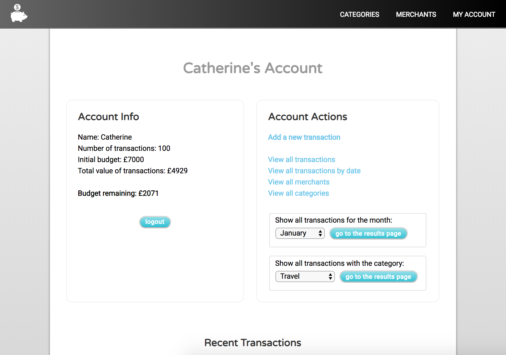

# Spending Tracker App
A simple spending tracker that logs transactions with assigned merchants and
categories. Built with Sinatra/Ruby, PostgreSQL, no ORM/ODM, plain HTML/CSS and no
JavaScript.



## Info
A live version of the app can be viewed here https://spending-tracker-app.herokuapp.com/

Trello board at https://trello.com/b/cuYq4gas/spending-tracker

## Up and running

To get the app running locally, clone down the repo then:

```bash
cd spending-tracker
create_db spending-tracker-4567
bundle install
rake db:build
rake db:seed
ruby app.rb
```
